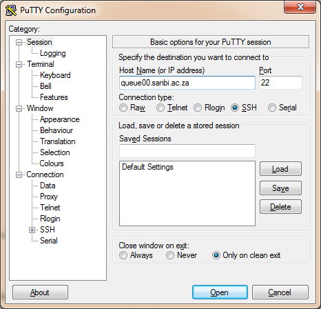

# Logging in to the SANBI cluster head node

To use the SANBI computer cluster you need to first log in to the head node, a computer called **queue00**. You can only do this when you are on the SANBI network and how you do this will depend on what operating system your computer is running: ___Linux___, ___MacOS___ or ___Windows___. Before this you need to know your SANBI cluster username and password.

The two steps of connecting are opening a `terminal` and then making the connection. These steps are somewhat similar on Linux and MacOS, but a little different on Windows.

## Linux/MacOS

### Opening a terminal

The `terminal` application will act as your portal to connect to the SANBI cluster and issue it with commands.

#### On Linux

If you are running ___Ubuntu Linux___ you need to open the `terminal` application. There are two ways to do this. The quickest it the key combination **Control-Alt-T**. Hold down those three keys together and `terminal` will open.

The second way is via the [_Unity_](https://en.wikipedia.org/wiki/Unity_(user_interface)) graphical menu. This can be opened by pressing the _Super (Windows/Start)_ key on your keyboard, which looks like this:  or by clicking the Ubuntu symbol  in the top left of your screen. Then type `terminal` to search for the application and click on it to start the application.

#### On MacOS

To open a `terminal` on MacOS open Spotlight search (for example by holding down _Command-Space_) and type `terminal` to search for the `terminal` application and click on it to start the application.

### SSH to queue00

In your `terminal` application type the command:

```bash
ssh username@queue00
```

where **username** should be your SANBI cluster username, e.g. **kay**. You should receive a warning message like this:

```bash
The authenticity of host 'queue00 (192.168.2.42)' can't be established.
ECDSA key fingerprint is e4:87:c2:ca:5e:57:8b:1a:83:44:a4:b5:2d:11:aa:31.
Are you sure you want to continue connecting (yes/no)?
```

Type **yes** to continue connection. You will get this warning message every time you connect to a computer for the first time. You will now be asked for your password:

```bash
username@queue00's password: 
```

Enter your SANBI cluster password and press _Enter_. You should now see output like the following:

```bash
Welcome to Ubuntu 14.04.4 LTS (GNU/Linux 3.13.0-68-generic x86_64)

 * Documentation:  https://help.ubuntu.com/

  System information as of Tue Mar  1 14:20:10 SAST 2016

  System load:  0.0               Processes:           137
  Usage of /:   82.2% of 9.72GB   Users logged in:     1
  Memory usage: 29%               IP address for eth0: 192.168.2.42
  Swap usage:   3%                IP address for eth1: 192.168.6.115

  Graph this data and manage this system at:
    https://landscape.canonical.com/
Last login: Tue Mar  1 14:20:11 2016 from sites.sanbi.ac.za
username@queue00:~$ 
```

The _@queue00_ after your username shows that you are now connected to the computer named _queue00_ and any commands that you type will run on this computer. Always look out for this _@queue00_ so that you know you are connected to the correct computer.

## Windows

### Using PuTTY

**PuTTY** is a SSH client for Windows that will let you connect to _queue00_. You can download [PuTTY](https://www.putty.org/) here. Download the **putty.exe** file and run it from a directory on your computer. (Unlike many other Windows applications, you run Putty by running _putty.exe_ after downloading it, there is no installation step.) After giving the program permission to run you will see a screen like this:



Type in **queue00.sanbi.ac.za** in the _Host Name_ field and click _Open_. You will see a screen asking you to accept the _queue00_ host fingerprint, accept this and then you will be asked for your SANBI cluster username and password. Once you have entered both of these you will see a screen showing something similar to this:

```bash
Welcome to Ubuntu 14.04.4 LTS (GNU/Linux 3.13.0-68-generic x86_64)

 * Documentation:  https://help.ubuntu.com/

  System information as of Tue Mar  1 14:20:10 SAST 2016

  System load:  0.0               Processes:           137
  Usage of /:   82.2% of 9.72GB   Users logged in:     1
  Memory usage: 29%               IP address for eth0: 192.168.2.42
  Swap usage:   3%                IP address for eth1: 192.168.6.115

  Graph this data and manage this system at:
    https://landscape.canonical.com/
Last login: Tue Mar  1 14:20:11 2016 from sites.sanbi.ac.za
username@queue00:~$ 
```

This means that you are connected to the computer named _queue00_.
