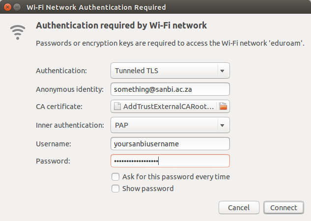

# Connecting to Eduroam with SANBI credential

`eduroam` allows staff and students from SANBI to connect to a WiFi network at any institution offering an eduroam access point. It does this by routing your authentication request to your home institution, i.e. it knows that `@sanbi.ac.za` means SANBI. To use this you need:

1. Your SANBI identity: username and password. This is the same username and password that you use to access email, SSH into servers and so on at SANBI.
2. A computer with WPA2 Enterprise support. Googling suggests that this works on some versions of Windows, MacOS, Linux and Android.

## Configuring SANBI eduroam on Ubuntu Linux

When you see a eduroam hostspot in your WiFi network list, click on it to connect and you’ll this network settings dialog box:

Make sure you use these settings:

- Authentication: Tunneled TLS
- Anonymous Identify: _something@sanbi.ac.za_
- CA certificate: the AddTrust External CA Root certificate, which you can download from Comodo at [this page](https://support.comodo.com/index.php?/comodo/Knowledgebase/Article/View/917/91/)
- Inner authentication: PAP
- Username: _Your SANBI username_ (e.g. pvh – just a username, no @sanbi.ac.za)
- Password: _Your SANBI password_

And then click connect.

## Configuring eduroam on MacOS X

To use eduroam on a Mac you need to install the SANBI eduroam profile. Download the [profile file](http://docs.wp.sanbi.ac.za/?attachment_id=45) and save it as **sanbi_eduroam.mobileconfig**. Double click to install it and a System Settings window will open, asking you to enter your username and password for the profile (just use your plain username – i.e. **myuser**, not **myuser@sanbi.ac.za**). You **don’t** need to enter these at installation time. If you _do_ enter them now, but you make a mistake, you will have to delete this profile and start again. If you _don’t_ enter your username and password at this stage, you will be asked for them when you connect to eduroam.

After you add the profile, you will be asked to authorise the change that you’re making to your system settings. Once that’s done, you’ll be able to connect to eduroam from your Mac.