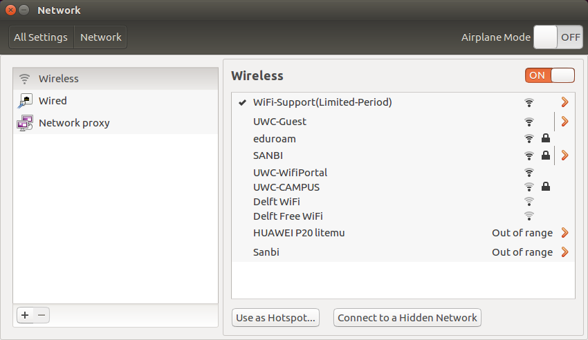
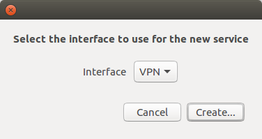
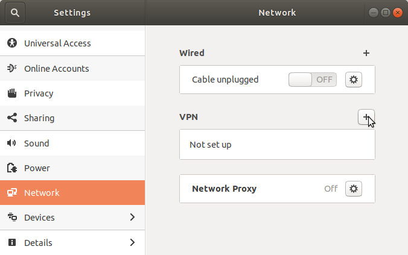
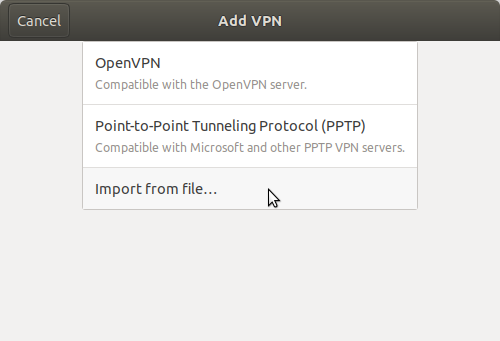
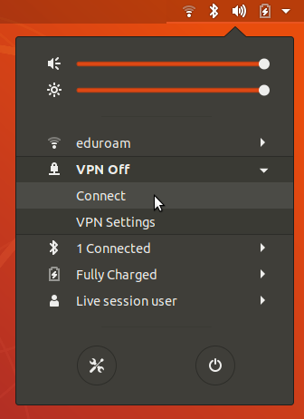

# Using the SANBI VPN

A user might want to access some UWC internal network devices or services while being outside of the university. In this case, the user must use a VPN connection in order for the user's machine to act is if they are on the UWC network.

=

## Ubuntu Linux

### 16.04

#### Installing the packages

Some software packages are required to get OpenVPN to work on Ubuntu 16.

Open a terminal (Ctrl + Alt + T) and enter:

```shell
sudo apt install network-manager-openvpn-gnome
```

Once the install is complete, you'll have new network options made available to you in the system settings.

#### Configure the VPN

**Download the OpenVPN profile file  [HERE](https://raw.githubusercontent.com/SANBI-SA/user_documentation/master/docs/_files/OVPN_SANBI_linux.ovpn)**.

Open the `System Settings` dialog and select the `Network` icon. You will see the following screen:



Click the plus icon in the lower left of the window, make sure that `VPN` is selected in the `Interface` dropdown and click `Create...` .



In the dropdown (shown below), select `Import a saved VPN configuration...`, click `Create...`, select the downloaded `OVPN_SANBI_linux.ovpn` file and click `Open`.


A new window will pop up where you must type your authentication credentials (**without @sanbi.ac.za**) under the `User name:` and `Password:` fields. Click `Save` when done.


**_OPTIONAL:_ You can allow this VPN to only provide the IP addresses from within SANBI and not route all of your traffic through SANBI. To do this, go to the `IPv4 Settings` tab in the window above followed by `Routes...`, tick on `Use this connection only for resources on its network` and click `OK` followed by `Save`.**

You can now connect to the SANBI VPN from the network dropdown.


### 17.10+

Since Ubuntu 17.10 onwards introduced the Gnome desktop manager instead of the old Unity desktop manager, the way to add and connect to VPNs has changed slightly.

#### Installing the packages

You'll need to ensure that the appropriate apt repositories are enabled before you can install all the OpenVPN packages:

```shell

sudo add-apt-repository universe
sudo add-apt-repository multiverse
sudo apt update
```

Open a terminal (Ctrl + Alt + T), enter:

```shell
sudo apt install openvpn network-manager-openvpn network-manager-openvpn-gnome
```
and hit enter. This will install the client packages for OpenVPN on your machine.

Once the installation is complete, run the following command to restart the networking service:

```shell
sudo service network-manager restart
```

#### Configure the VPN

**Download the OpenVPN profile file [HERE](https://raw.githubusercontent.com/SANBI-SA/user_documentation/master/docs/_files/OVPN_SANBI_linux.ovpn)**.

 Open the system `Settings` dialog and select the `Network` tab on the left. You'll see the `VPN` heading.



Click the `+` icon to the right of the heading and select the `Import from file...` option.



Select the `OVPN_SANBI_linux.ovpn` file in the dialog box that opens and click `Open`.

A new window will pop up where you must type your authentication credentials (**without @sanbi.ac.za**) under the `User name` and `Password` fields. Click `Add` when done.


**_OPTIONAL:_ You can allow this VPN to only provide the IP addresses from within SANBI and not route all of your traffic through SANBI. To do this, go to the `IPv4` tab in the window above, tick on `Use this connection only for resources on its network` and click `Add`.**

You will now see your VPN connection listed under the `VPN` heading. You'll now be able to connect to the SANBI VPN.

